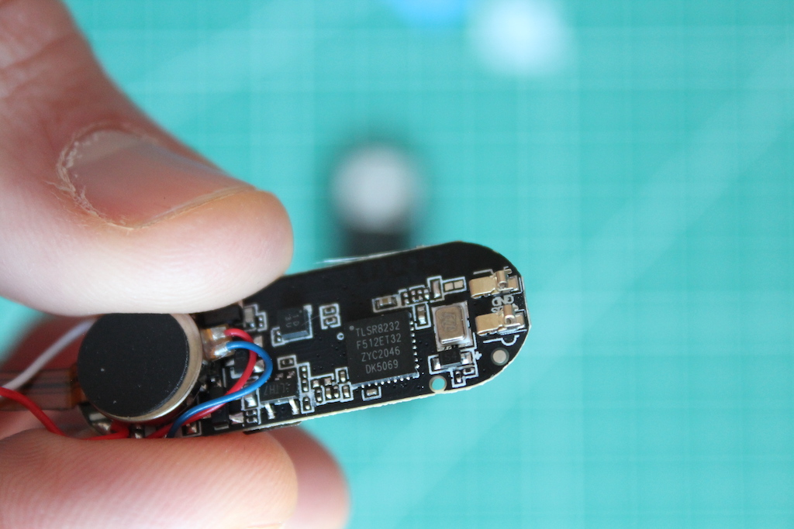
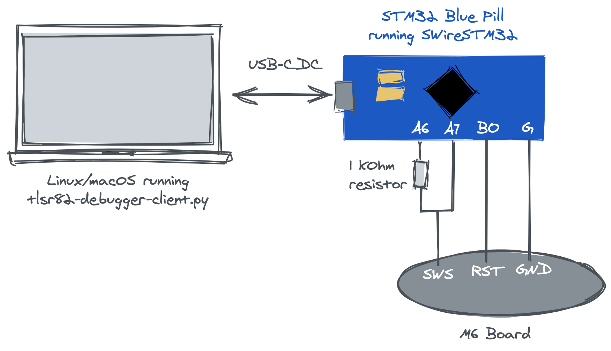

# m6-reveng

This repo contains information and tools for reverse engineering the $7 M6 smart fitness band.


# Hardware


The SoC (system-on-a-chip) is a Telink [TLSR8232](http://wiki.telink-semi.cn/wiki/chip-series/TLSR823x-Series/).
* [Datasheet](http://wiki.telink-semi.cn/doc/ds/DS_TLSR8232-E_Datasheet%20for%20Telink%20BLE%20SoC%20TLSR8232.pdf)
* 32-bit proprietary MCU
  * Closed ture, not a lot of resources about it
  * 24 MHz clock speed
* 16kB of SRAM
* 512kB of flash
* 32kHz oscillator for low power mode
* SWS (Single Wire Slave) interface for debugging and programming

# The Setup
The Telink TLSR82xx series SoCs are debugged and programmed using the closed SWS (Single Wire Slave, or SWire) protocol. [pvvx](https://github.com/pvvx) did a fantastic job reverse engineering this protocol and creating an alternative programmer based on the [STM32 Blue Pill]() board. The [TlsrTools](https://github.com/pvvx/TlsrTools) project contains both the STM32 software ([SWireSTM32](https://github.com/pvvx/TlsrTools/tree/master/SWireSTM32)) and a Windows GUI application for controlling the STM32 board.

The TlsrTools project was developed for the TLSR826x. I originally introduced changes to this project, but later I realized our TLSR8232 chip uses the same SWS protocol. This means we can simply [flash this precompiled binary](https://github.com/pvvx/TlsrTools/tree/master/STM32F103) to our STM32 and use it as the middleman for debugging the M6.



I did not use the Windows GUI application, and instead wrote my own Python script ([tlrs82-debugger-client.py](./tlrs82-debugger-client/tlrs82-debugger-client.py)) that connects to and controlls the STM32 via USB. The commands and timings are tailored for the TLSR8232 SoC, but should be easily adaptable for other TLSR82xx chips.

# Reading the chip ID
Register 0x007e is a special register in the TLSR that contains the chip identification. This is a good way to verify that everything is working as expected.
```bash
$ python tlsr82-debugger-client.py --serial-port /dev/cu.usbmodem6D8E448E55511 get_soc_id
Found and set suitable SWS speed: 7
SOC ID: 0x5316
```

# Dumping the RAM
```bash
$ python tlsr82-debugger-client.py --serial-port /dev/cu.usbmodem6D8E448E55511 dump_ram ram.bin
Found and set suitable SWS speed: 7
Dumping ram to ram.bin...
0x0000 00.00%
0x0100 00.39%
...
0xfe00 99.22%
0xff00 99.61%
Writing 65536 bytes to ram.bin
```

# Dumping the flash
```bash
$ python tlsr82-debugger-client.py --serial-port /dev/cu.usbmodem6D8E448E55511 dump_flash flash.bin
Found and set suitable SWS speed: 7
Dumping flash to flash.bin...
CPU stop.
CSN high.
0x000000 00.00%
0x000100 00.05%
0x000200 00.10
...
0x07cd00 99.85%
0x07ce00 99.90%
0x07cf00 99.95%
Writing 512000 bytes to flash.bin
```